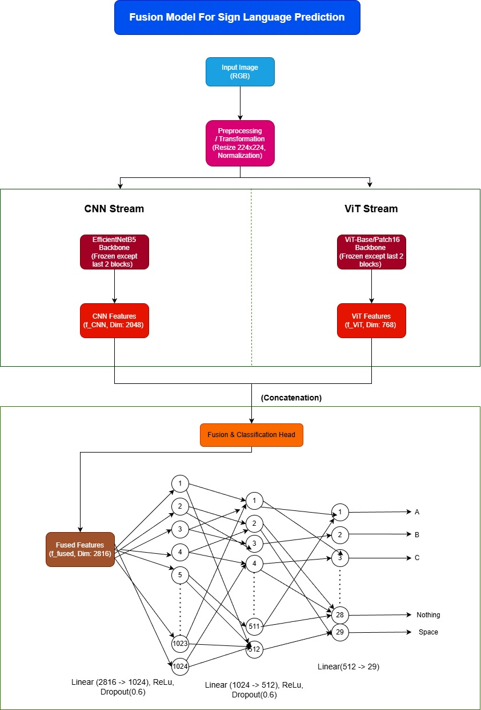

**FusionASLModel: High-Performance Sign Language Recognition**

**Dual-Backbone CNN-ViT Feature Fusion for ASL Alphabet Classification**

This project introduces the FusionASLModel, a novel deep learning architecture that combines the local feature extraction of EfficientNetB5 with the global contextual understanding of a Vision Transformer (ViT-Base). By leveraging a dual-backbone approach, the model achieves near-perfect classification for American Sign Language (ASL) gestures.

**Key Features**

Hybrid Architecture: Fuses a pre-trained EfficientNetB5 [1] and ViT-Base [2] to capture both fine-grained textures and long-range spatial relationships.

Strategic Fine-Tuning: Targets only the last two blocks of each backbone to maximize transfer learning efficiency and prevent catastrophic forgetting.

Exceptional Accuracy: Achieved a 1.0000 Accuracy and 1.0000 Macro F1-Score on the ASL Alphabet test set.

Robust Data Pipeline: Utilizes aggressive transformations including RandomPerspective, ColorJitter, and RandomErasing for high generalization.

**Model Architecture**

The architecture consists of two concurrent streams whose features are concatenated and passed into a custom classification head.

Technical Specifications

CNN Backbone: EfficientNetB5 extracting 2,048-dimensional local features (f_CNN).

ViT Backbone: ViT-Base/Patch16_224 extracting 768-dimensional global features (f_ViT).

Fused Feature Vector: A 2,816-dimensional vector (f_fused) formed via concatenation.

Classification Head: Three linear layers (2816 → 1024 → 512 → 29) with ReLU activations and Dropout(0.6) for regularization.

  

**Dataset**

The model was trained using the ASL Alphabet Dataset [3], which contains 87,000 balanced images.

Alphabet Classes: 26 letters (A-Z) with 3,000 images each.

Control Classes: SPACE, DELETE, and NOTHING (3,000 images each).

Input Size: 224 x 224 pixels (resized from 200 x 200).

**Performance & Results**

The model demonstrated rapid convergence, reaching perfect validation metrics by Epoch 4.

Training Summary
| Epoch | Train Loss | Val Loss | Train Acc | Val Acc | Train F1 | Val F1 |
| :--- | :---: | :---: | :---: | :---: | :---: | :---: |
| 1 | 1.9273 | 0.0777 | 0.4464 | 0.9878 | 0.4469 | 0.9878 |
| 2 | 0.2366 | 0.0018 | 0.9380 | 0.9999 | 0.9380 | 0.9999 |
| 3 | 0.1190 | 0.0005 | 0.9693 | 0.9999 | 0.9693 | 0.9999 |
| 4 | 0.0855 | 0.0003 | 0.9775 | 1.0000 | 0.9775 | 1.0000 |
| 5 | 0.0740 | 0.0002 | 0.9803 | 1.0000 | 0.9803 | 1.0000 |
| 6 | 0.0701 | 0.0001 | 0.9816 | 1.0000 | 0.9816 | 1.0000 |

**Final Test Metrics**

| Test Set Metric | Value |
| :--- | :--- |
| **Accuracy** | 1.0000 |
| **Macro F1 Score** | 1.0000 |
| **Test Loss** | 0.0002 |

**Installation & Usage**
Clone the Repository:

Bash
git clone https://github.com/SoumabrataBhowmik/Sign_language_predictor.git
cd Sign_language_predictor
Environment Setup:
Ensure you have Python installed with the necessary libraries: torch, torchvision, timm, matplotlib, and PIL.

Run the Notebook:
Open Sign_Language_Prediction_Val & Test_f1-Score_1.000_final.ipynb in Jupyter or Google Colab to see the full implementation, training logs, and evaluations.

**References**

[1] Tan, M., & Le, Q. V. (2019). EfficientNet: Rethinking Model Scaling for Convolutional Neural Networks. ICML. 

[2] Dosovitskiy, A., et al. (2021). An Image Is Worth 16x16 Words: Transformers for Image Recognition at Scale. ICLR. 

[3] ASL Alphabet Dataset. Kaggle.
